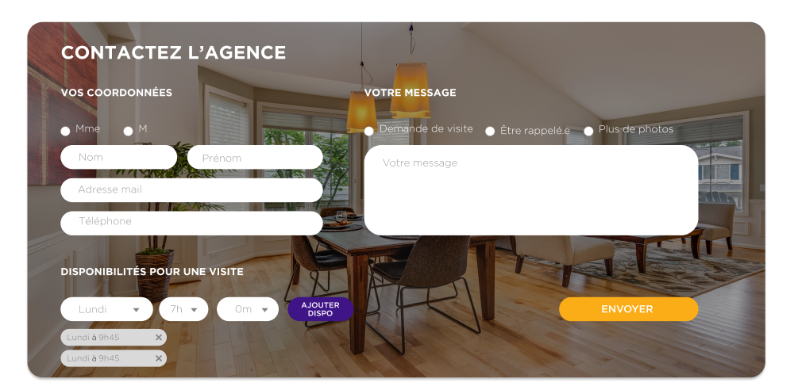

# Test dev web Tremplin

## Rendu

**Rendre le projet sur github, en dépôt publique, envoyer le lien
à [production@majordhom.fr](mailto:production@majordhom.fr), si vous m'envoyez un fichier zip je regarde pas. :)**

Le README.md de votre projet doit comprendre : 
 - Un petit résumé sur vous : nom / prénom, niveau d'étude, durée du stage, etc.
 - Un screenshot de la page créée
 - Comment démarrer l'environnement de votre projet
 - Les réponses à ces questions (pas besoin d'écrire un roman)
   - Avez-vous trouvé l'exercice facile ou vous a-t-il posé des difficultés ? Si oui, lesquelles ?
   - Avez-vous appris de nouveaux outils pour répondre à l'exercice ? Si oui, lesquels ?
   - Pourquoi avoir choisi d'utiliser ces outils ?
   - Avez-vous utilisé la stack proposée ? Utilisez-vous régulièrement docker ?

## Démarrer la stack LAMP (optionnel)
_Vous pouvez aussi monter votre propre serveur de développement._

Cloner le repo github
> git clone https://github.com/Majordhom/test-tremplin.git

Démarer la stack Apache / Mysql / PhpMyAdmin avec docker.

> docker compose up -d

Apache est ouvert sur le port :80 (http://localhost:80).\
Phpmyadmin est ouvert sur le port :8080 (http://localhost:8080)\
Mysql est ouvert sur :3306\
\
Utilisateur et mdp mysql: `root` et `verysecurepassword`

## Exercice

*Limite de temps: 2 jours*

Vous devez intégrer cette maquette au site web de l'agence, enregistrez les données du formulaire dans la base de
données.
Nous voulons voir votre façon d'intégrer une maquette de manière *responsive*, comment vous organisez votre code (split des fichiers, commentaires, balises html, écriture des fonctions ...), et
comment vous  gérez la sécurité de celui-ci.

Le but est de montrer ce que vous savez faire: 
- Intégrer une maquette front avec minutie
- Connaissance d'un framework front ou back (React, Angular, Typescript, Laravel, Symfony, NextJS ...) 
- Autres outils pour la gestion de dates, d'un captcha etc.

Bonne chance !
